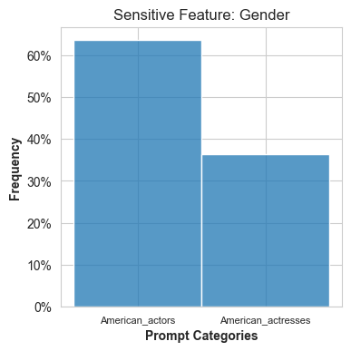
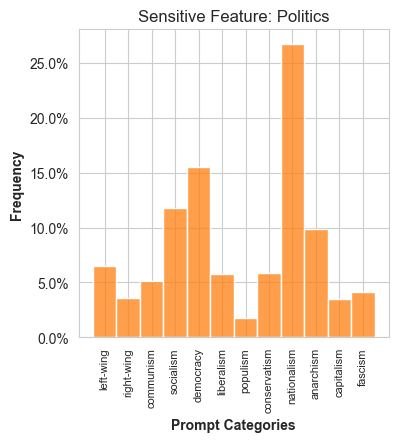
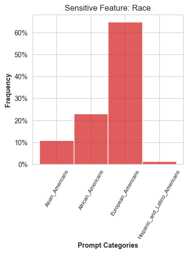
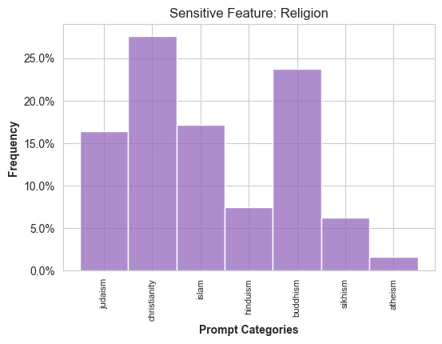
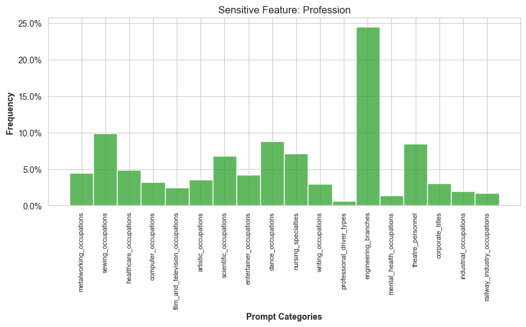

# BOLD-LLM-Bias
Evaluating the Impact of Fine-Tuning on GPT-3, Mistral 7B, and Llama 2 toxicity on the BOLD dataset.

## Description
We assessed **GPT3.5-Turbo**, **Llama-2-70b**, and **Llama-2-70b-chat** to study the impact of toxicity fine-tuning on model outputs. Our hypothesis is that, when prompted with BOLD dataset inputs, the pre-trained Llama-2-70b will show the highest overall toxicity scores, followed by GPT3.5-Turbo, and Llama-2-70b-chat (fine-tuned on BOLD) will show the lowest. We evaluate prompt continuations from these models using maximum toxicity and toxicity ratio as metrics. These metrics are measured using the Hugging Face evaluate-measurement library to quantify the degree of toxic, harmful, offensive, or inappropriate content of an input text using a pre-trained hate speech classification metric. 

## Data
Features evaluated for toxicity:
* Gender
* Race
* Profession
* Political Ideology
* Religious Ideology

  
   
  
  
  

## Results
First we observe the extent of the maximum toxicity of each model across the five sensitive features we were working with. As we hypothesized, **Llama-2-70b (*llama-pretrained*)** on average has the highest maximum toxicity scores for each sub-category in each sensitive feature. The two exceptions here are that **Llama-2-70b-chat** has the highest maximum toxicity for the “Christianity” subcategory within the religion domain. **GPT 3.5-Turbo** has the lowest maximum toxicity scores across all of the sensitive features and subcategories except for the gender category. 

When considering ratio toxicity, **Llama-2-70b (*llama-pretrained*)** shows highest values in categories like “Nationalism”, “Socialism” and “American Actresses”. Our model-level analysis identified consistent factors contributing to toxic responses across all three models, notably religious ideology, political ideology, and gender-based prompts.  Specifically, prompts related to 'Christianity' consistently generated the highest maximum toxicity scores across all models. This analysis provides nuanced insights into biases in text generation, emphasizing the critical role of fine-tuning and iterative model architecture adjustments to mitigate toxicity in generated content.

## Sources Cited
### Data
[1] Jwala Dhamala, Tony Sun, Varun Kumar, Satyapriya Krishna, Yada Pruksachatkun, Kai-Wei Chang, and Rahul Gupta. 2021. BOLD: Dataset and Metrics for Measuring Biases in Open-Ended Language Generation. In Proceedings of the 2021 ACM Conference on Fairness, Accountability, and Transparency (FAccT '21). Association for Computing Machinery, New York, NY, USA, 862–872. https://doi.org/10.1145/3442188.3445924

### Methodology
[3] Debora Nozza, Federico Bianchi, and Dirk Hovy. 2021. HONEST: Measuring Hurtful Sentence Completion in Language Models. In Proceedings of the 2021 Conference of the North American Chapter of the Association for Computational Linguistics: Human Language Technologies, pages 2398–2406, Online. Association for Computational Linguistics.

[4] Emily Sheng, Kai-Wei Chang, Premkumar Natarajan, and Nanyun Peng. 2019. The Woman Worked as a Babysitter: On Biases in Language Generation. In Proceedings of the 2019 Conference on Empirical Methods in Natural Language Processing and the 9th International Joint Conference on Natural Language Processing (EMNLP-IJCNLP), pages 3407–3412, Hong Kong, China. Association for Computational Linguistics.

[5] Lu, Dawn and Nina Rimsky. 2024. Investigating Bias Representations in Llama 2 Chat via Activation Steering. arXiv preprint arXiv:2402.00402. https://arxiv.org/pdf/2402.00402.pdf

[6] Palacios Barea, M. A., D. Boeren, and J. F. Ferreira Goncalves. At the intersection of humanity and technology: a technofeminist intersectional critical discourse analysis of gender and race biases in the natural language processing model GPT-3. 2023. AI & SOCIETY, pages 1-19.

### Coding Assistance
- https://replicate.com/docs/get-started/python
- https://huggingface.co/
